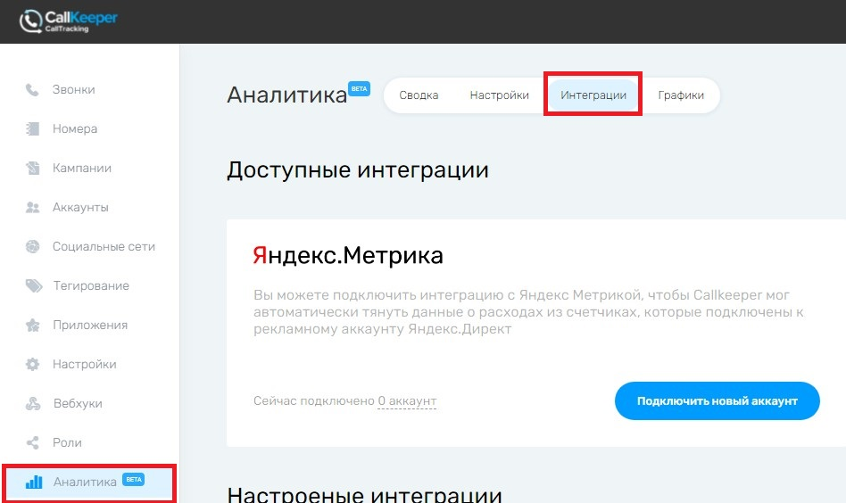
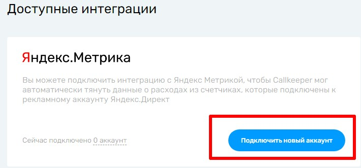
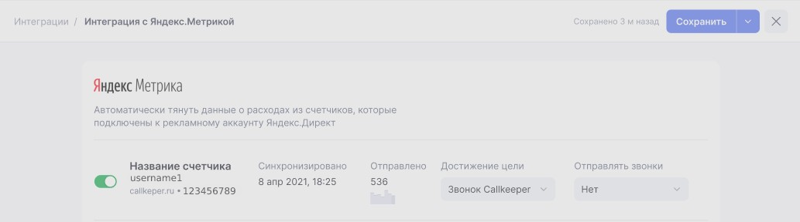

# Yandex

## Навигация
* [Описание ](#Описание)
* [Подключение Яндекс.Метрики в личном кабинете CallKeeper](#Подключение-Яндекс.Метрики-в-личном-кабинете-CallKeeper)
* [Подключение новых аккаунтов ](#Подключение-новых-аккаунтов)
* [Настройки счётчиков ](#Настройки-счётчиков)

## Описание

Интеграция позволит передавать данные о звонках в счётчики Яндекс.Метрики. 

Будут передаваться данные по "обратным звонкам" и звонкам "колтрегинга".

Данные для отправки можно будет выбрать в настройках счётчика после его добавления.

## Подключение Яндекс.Метрики в личном кабинете CallKeeper

Для подключения интеграции необходимо:

1. Зайти в свой личный кабинет на https://ckct.ru/ :

2. Перейти на вкладку аналитика в левой части экрана и в открывшейся вкладке выбрать в верхнем меню пункт интеграции:

3. Нажать на кнопку Подключить новый аккаунт в окне доступные интеграции:

4. Откроется окно авторизации Яндекс , где необходимо ввести данные аккаунта под которым вы хотите войти:

5. После этого откроется странница на который необходимо выбрать счетчики которые вы хотите добавить: 

## Подключение новых аккаунтов 

 Для добовления нового аккаунта необходимо нажать "Добавить" и повторить "4" и "5" пункты раздела "Подключение Яндекс.Метрики в личном кабинете CallKeeper" :

## Настройки счётчиков

Для настройки счётчиков необходимо нажать на его название и откроется окно настройки : 

Где вы сможете выставить настройки под нужные вам параментры.

После выставления настроек их необходимо сохранить :

[Вернуться к оглавлению](#навигация)

[Вернуться на главную](/README.md/#documentation)
