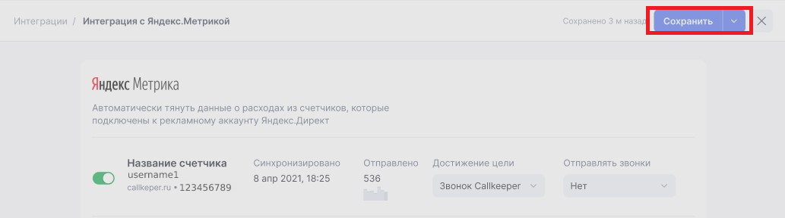

# Yandex

## Навигация
* [Описание ](#Описание)
* [Подключение Яндекс.Метрики в личном кабинете CallKeeper](#Подключение-Яндекс.Метрики-в-личном-кабинете-CallKeeper)
* [Подключение новых аккаунтов ](#Подключение-новых-аккаунтов)
* [Настройки счётчиков ](#Настройки-счётчиков)

## Описание

Интеграция позволяет отправлять звонки динамического и статического коллтрекинга, а также обратные звонки CallKeeper и их параметры в стандартные отчеты по звонкам в Яндекс.Метрику.

Чтобы настроить передачу данных, необходимо авторизоваться в аккаунте Яндекс.Метрики https://metrika.yandex.ru/ под правами администратора или редактора.

Перейдите по ссылке https://ckct.ru/dev/lk/integrations в раздел Интеграции в личном кабинете Callkeeper. Из представленных интеграций выберите

## Подключение Яндекс.Метрики в личном кабинете CallKeeper

Для подключения интеграции необходимо:

1. Зайти в свой личный кабинет на https://ckct.ru/ :

2. Необходимо зайти в раздел интеграции и нажать подключить:

3. Откроется окно авторизации Яндекс , где необходимо ввести данные аккаунта под которым вы хотите войти:

4. После этого откроется странница на который необходимо выбрать счетчики которые вы хотите добавить: 

## Подключение новых аккаунтов 

 Для добовления нового аккаунта необходимо нажать "Добавить" и повторить "4" и "5" пункты раздела "Подключение Яндекс.Метрики в личном кабинете CallKeeper" :

## Настройки счётчиков

Для настройки счётчиков необходимо нажать на его название и откроется окно настройки : 

Где вы сможете выставить настройки под нужные вам параментры.

После выставления настроек их необходимо сохранить :

## Отчеты
Передаваемые данные собираются в отдельную группу отчетов в Яндекс.Метрике: «Качество обработки звонков», «Источники звонков», «Звонки, детально».

Отчет **ачество обработки звонков»** казывает длительность звонка и долю пропущенных звонков. Данные помогут проанализировать эффективность работы менеджеров или коллцентра.

Отчет «Источники звонков» показывает подробности о посетителях и их поведении на сайте. Отображает данные только по звонкам динамического коллтрекинга.

[Вернуться к оглавлению](#навигация)

[Вернуться на главную](/README.md/#documentation)
